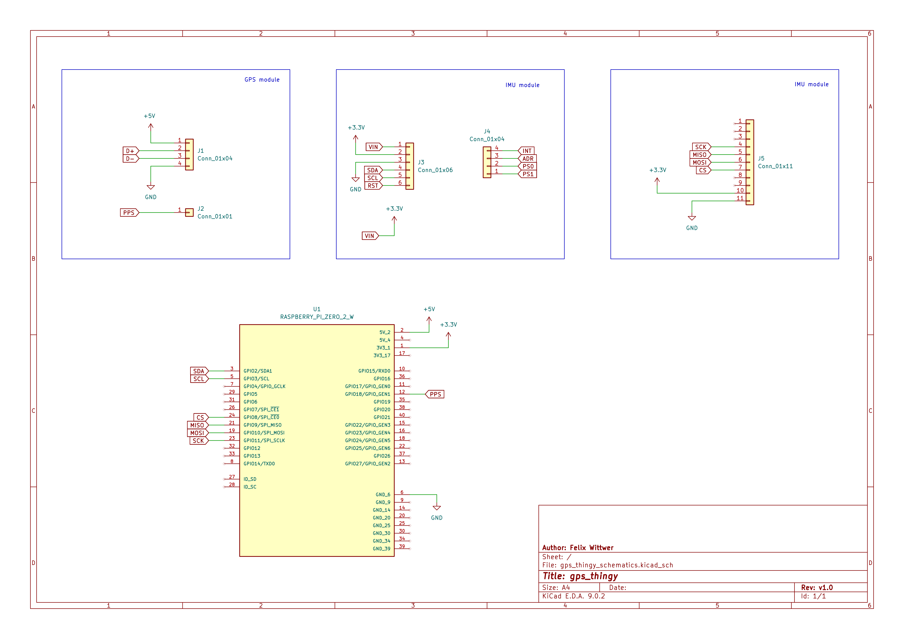

# undercity_gps_thingy
a nextgen GPS handheld that uses an IMU for better accuracy

## rough schematics (only so you know what to solder)

## BOM (at Undercity dev boards and breakout boards are used later a PCB might be good)

sensors
- BNO055 (https://www.adafruit.com/product/2472)
- GPS module (https://www.adafruit.com/product/4279)
display/ display driver
- Adafruit Qualia (https://www.adafruit.com/product/5800)
- 4" Square Touchscreen (https://www.adafruit.com/product/5794)
computing
- Raspberry Pi Zero

## Credits
- Raspberry Pi Zero 2W Symbol and Footprint by Raspberry Pi
  https://www.snapeda.com/parts/RASPBERRY%20PI%20ZERO%202%20W/Raspberry%20Pi/view-part/
- ultimate GPS module 3D model by Jason Febbraro
  https://grabcad.com/library/adafruit-ultimate-gps-gnss-with-usb-4279-1
- BNO-055 IMU module 3D model by Brey Caraway
  https://grabcad.com/library/adafruit-bno055-9-dof-imu-stemma-qt-1