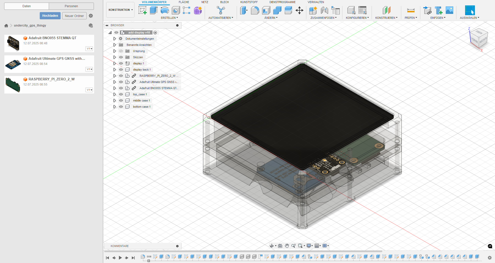
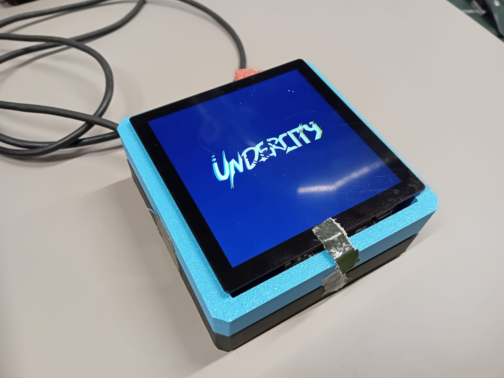
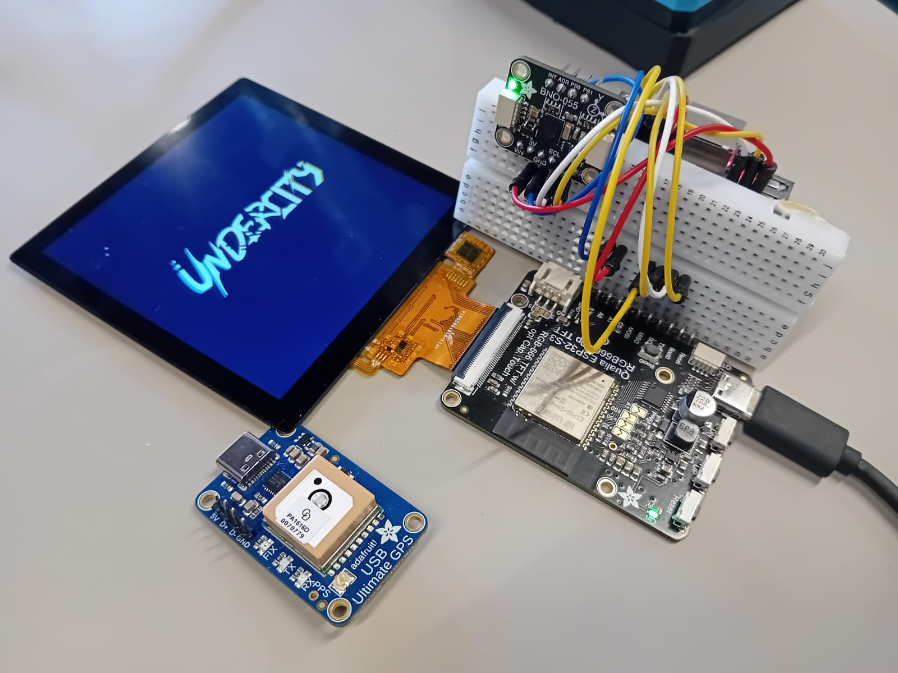
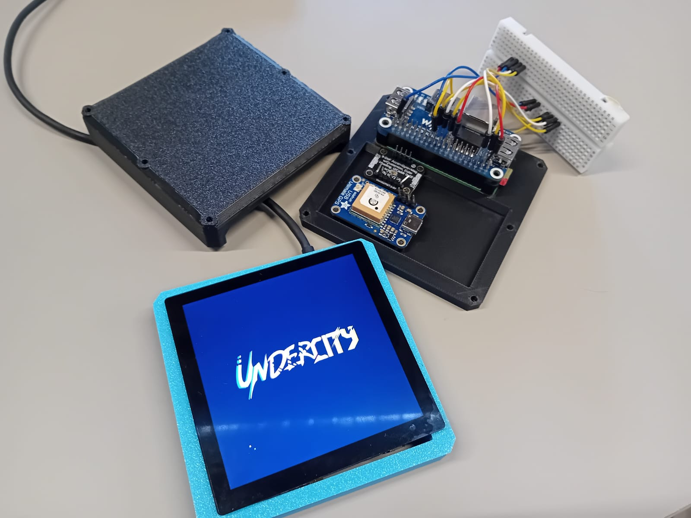
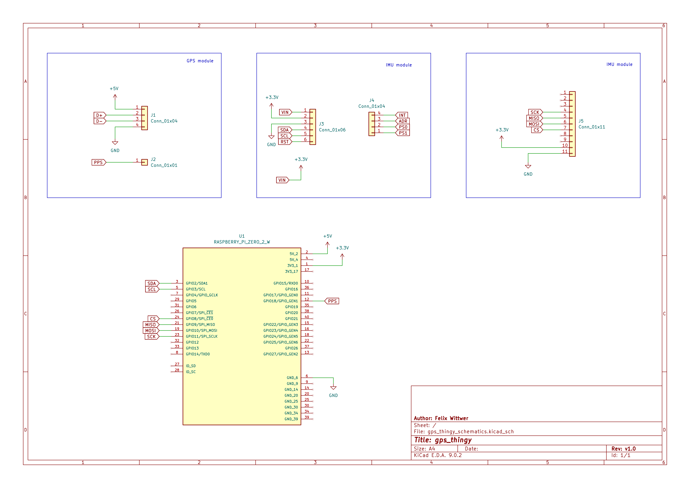

 

 

 

# undercity_gps_thingy (more like a IMU thingy now)
a nextgen GPS handheld that uses an IMU for better accuracy (sould it be in the future for naw it is mole like a IMU positioning device)

be aware that this was a single person project made during UNDERCITY a hardware hackathon. Therefore some things are not quite as polished due to time constarins.

Not quite polihed is a bit of an understatement. The GPS module uses a USP pinout for connection and therefor could not be integrated with the use of the available resources. 

## The Project

Every sub folder contains a seperate README with mor information about the stuff in it.

[Demo Video -> https://www.youtube.com/watch?v=G0mOPf9O1qc](https://www.youtube.com/watch?v=G0mOPf9O1qc)

Or watch as a gif here:

 

I know scrrenshots of CAD software isn't our best friend but just so you know where everything goes and how it was designed to look like :)

 

Now a real world image of the parts half assembled.

## Firmware

There will are two separate firmware files one for the ESP32 S3 on the [Qualia board](/firmware/qualia%20ESP32%20S3%20(display%20controling)/) to drive the display and recieve the sensor data and [one for](/firmware/sensorreading%20stuff/) the seperate microcontroller who is collecting the data from the BNO-055.

Besides the firmware for the individual controllers the is also a small [python visualiser](/firmware/pc%20visualisation/).

## rough schematics (only so you know what to solder)

## BOM (at Undercity dev boards and breakout boards are used later a PCB might be a good idea)

### (v1)

sensors
- BNO055 (https://www.adafruit.com/product/2472)
- GPS module (https://www.adafruit.com/product/4279)

display/ display driver
- Adafruit Qualia (https://www.adafruit.com/product/5800)
- 4" Square Touchscreen (https://www.adafruit.com/product/5794)

computing
- Raspberry Pi Zero

### (v2)
sensors
- BNO055 (https://www.adafruit.com/product/2472)

display/ display driver
- Adafruit Qualia (https://www.adafruit.com/product/5800)
- 4" Square Touchscreen (https://www.adafruit.com/product/5794)

computing
- Adafruit ESP32 S2 Mini 1 (https://www.adafruit.com/product/5000)

## Credits
- Raspberry Pi Zero 2W Symbol and Footprint by Raspberry Pi
  https://www.snapeda.com/parts/RASPBERRY%20PI%20ZERO%202%20W/Raspberry%20Pi/view-part/
- ultimate GPS module 3D model by Jason Febbraro
  https://grabcad.com/library/adafruit-ultimate-gps-gnss-with-usb-4279-1
- BNO-055 IMU module 3D model by Brey Caraway
  https://grabcad.com/library/adafruit-bno055-9-dof-imu-stemma-qt-1