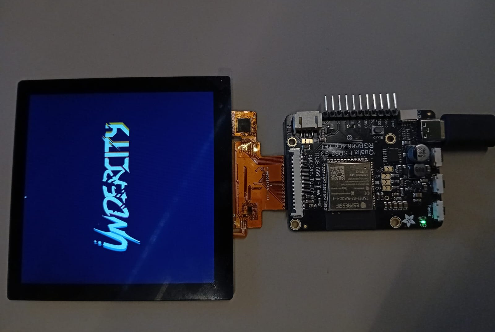

# firmware

This Folder contains all the firmware files you need.

There will are two separate firmware files one for the ESP32 S3 on the [Qualia board](/firmware/qualia%20ESP32%20S3%20(display%20controling)/) to drive the display and recieve the sensor data and [one for](/firmware/sensorreading%20stuff/) the seperate microcontroller who is collecting the data from the BNO-055.

## [Qualia ESP32 S3 (display)](/firmware/qualia%20ESP32%20S3%20(display%20controling)/)

    
    

## [Sensor reading](/firmware/sensorreading%20stuff/)

Sensor reading is done via I2C by the ESP32 S2.

## [pc visualisation](/firmware/pc%20visualisation/)

Because I couldn't get the connection between the tro ESP boards working I decided on writing a small Python script that does the job. On the display a screen demo will be running.