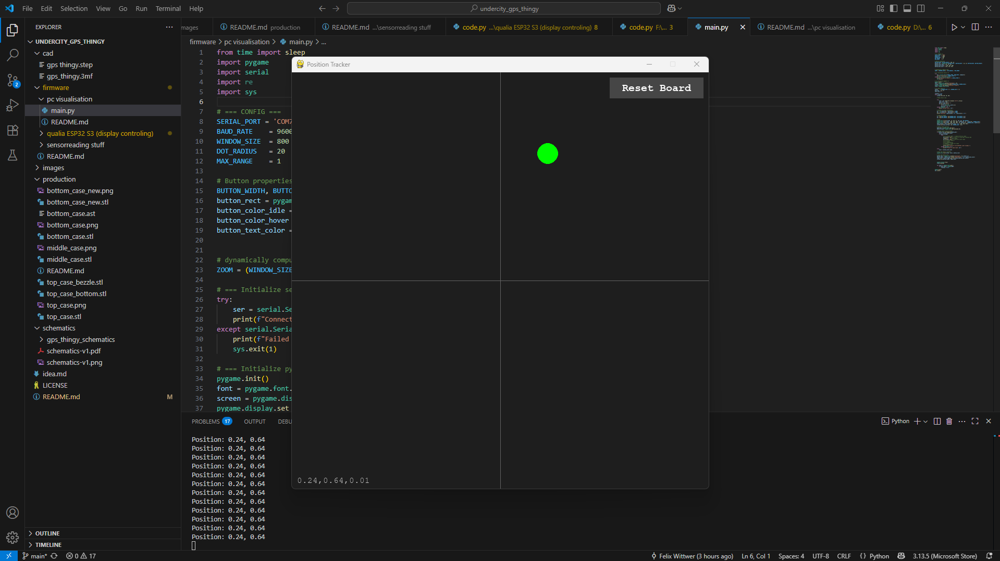

# pc visualisation

Because getting the values to the Qualia board turned out to be almost impossible I decided on writing a visializer based on asmall Python script.

It uses pygame to create a window and show the location of the IMU module. 

