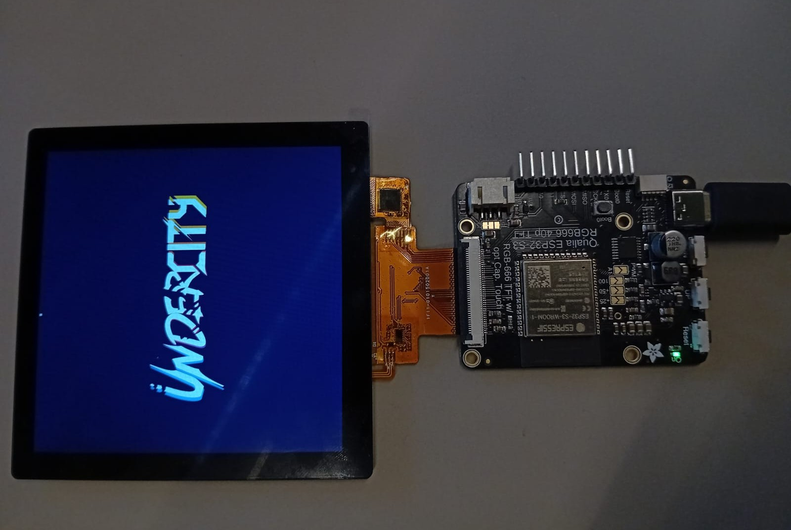

# Qualia firmware

This folder contains all firmware for the Adafruit Qualia board. This code is only for displaying stuff the sensor stuff is handeld by the other microcontroller.

## code.py

The actual firmware script you are ment to use.

## code_display_testing.py

A script for testing your display-

<p float="left">
    
    
</p>

## display settings

For me these values gave relatively stable results but sometimes the display flickers. Maybee I am doing something completly wrong because I am verry much of from the values Adafruit provides.

``` python
tft_timings = {
    "frequency": 10000000,
    "width": 720,
    "height": 720,
    "hsync_pulse_width": 4,
    "hsync_front_porch": 60,
    "hsync_back_porch": 60,
    "vsync_pulse_width": 4,
    "vsync_front_porch": 20,
    "vsync_back_porch": 20,
    "hsync_idle_low": True,
    "vsync_idle_low": True,
    "de_idle_high": False,
    "pclk_active_high": False,
    "pclk_idle_high": False,
}
```