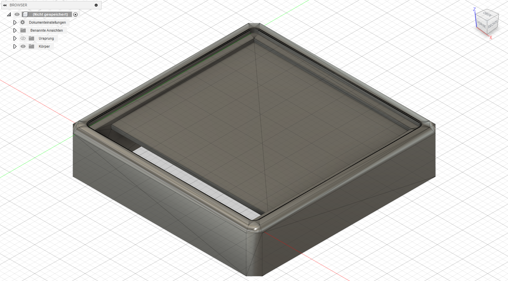
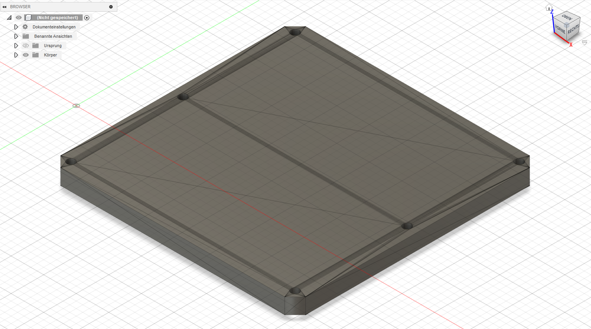
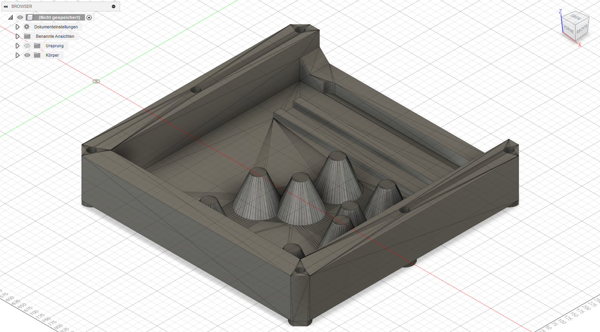

# production

This folder contains the files for 3D printing-

## old version with more overhangs but less parts

- top_case.stl
- middle_case.stl
- bottom_case.stl

    
    
    

## newer version with less overhangs

- top_case_bezzle.stl
- top_case_bottom.stl
- middle_case.stl (same)
- bottom_case_new.stl
